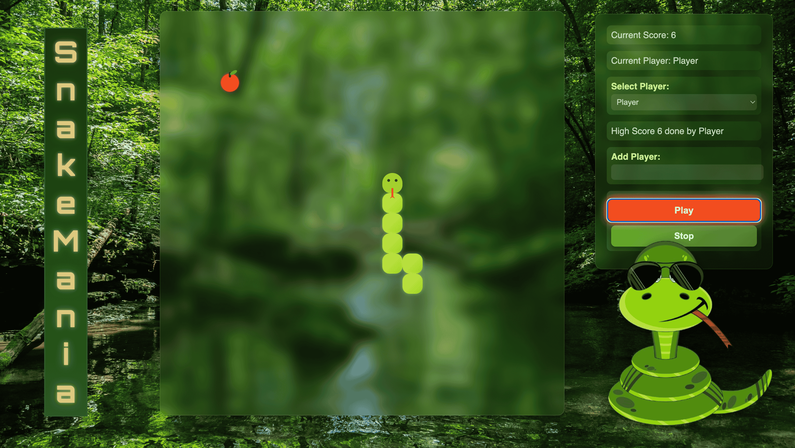

# SnakeMania (PRECOLLEGE REPO)

**SnakeMania** is a modern twist on the classic snake game, built for desktop browsers. Grow your snake, avoid collisions, and set high scores! This game is designed for fun, competitive play with multiple players and persistent local scores.

---

## Features

- **Classic Snake Gameplay**: Move, eat food, and grow your snake.
- **Multi-Player Support**: Add new players and switch between them easily.
- **Persistent High Scores**: Track scores using `localStorage`.
- **Responsive Desktop Design**: Optimized for large screens (min 1300x800).
- **Sound Effects**: Food pickup, movement, game over, and background music.
- **Play/Stop Controls**: Toggle the game anytime with active button highlight.

---

## How to Play

1. Open the game on a **desktop browser**.
2. Use **Arrow keys** or **WASD** to control the snake:
   - Up → `ArrowUp` / `W`
   - Down → `ArrowDown` / `S`
   - Left → `ArrowLeft` / `A`
   - Right → `ArrowRight` / `D`
3. Press **Play** to start or **Stop** to pause the game.
4. Eat the food to grow your snake and increase your score.
5. Avoid colliding with walls or yourself to keep playing.
6. High scores are tracked per player in your browser.

---

## Folder Structure

```
SnakeMania/
│
├── index.html          # Main HTML file
├── img/                # Images
├── css/
│   └── style.css       # Game and UI styles
├── js/
│   ├── index.js        # Game logic
│   └── playersManagement.js  # Player and highscore management
└── music/              # Audio files for game
    ├── food.mp3
    ├── move.mp3
    ├── gameover.mp3
    └── music.mp3
```

## ScreenShot


